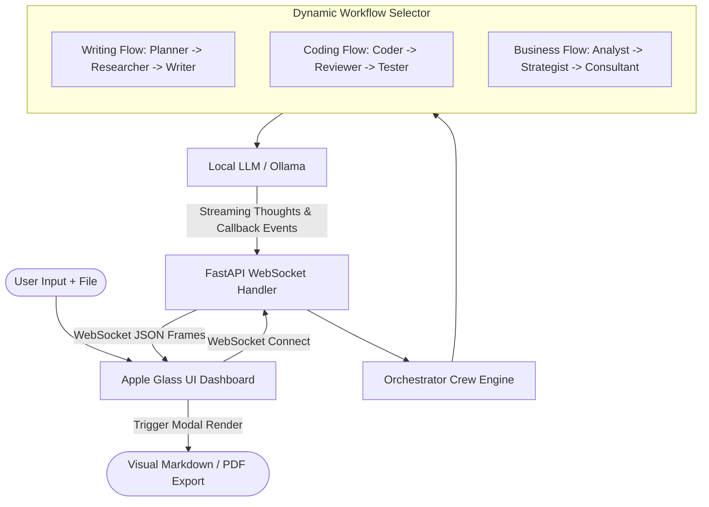

# 🤖 Multi-Agent Orchestrator

[](https://ollama.com/)
[](https://www.crewai.com/)
[](https://fastapi.tiangolo.com/)
[](https://opensource.org/licenses/MIT)

> **Multi-Agent Orchestrator** is a high-performance, local-first agentic platform featuring an **Apple Vision Pro (Glassmorphism) UI** and **Perplexity/Gemini aesthetics**. Powered by **CrewAI**, **FastAPI WebSockets**, and **Ollama**, it enables multiple open-source LLMs to plan, research, write code, run code reviews, and draft business strategy roadmaps collaboratively with zero cloud dependency and absolute data privacy.

https://github.com/egeetas/multi-agent-system.git

---

## ✨ Key Features

*   🔄 **Dynamic Multi-Agent Workflows (Crews):** Switch dynamically between workflows in the UI. Agent names, icons, and graph connection lines update instantly.
    1.  **Content Creator (Writing):** `Planner` ➔ `Researcher` ➔ `Writer` (Ideal for comprehensive essays, reports, and tutorials).
    2.  **Software Engineering (Coding):** `Coder` ➔ `Reviewer` ➔ `Tester` (Ideal for drafting scripts, structural code reviews, and generating unit tests).
    3.  **Business Analyst (Strategy):** `Analyst` ➔ `Strategist` ➔ `Consultant` (Ideal for competitor analysis, SWOT matrices, and business roadmaps).
*   📂 **Local RAG (Retrieval-Augmented Generation):** Drag-and-drop or select any `.pdf`, `.txt`, `.md`, `.json`, or `.csv` file. The backend dynamically extracts content and feeds it as active context to the agents' tasks.
*   🔌 **Local-First & Offline:** Runs completely on your local machine using **Ollama**. No OpenAI API keys, zero subscription costs, and 100% private.
*   🌐 **Real-Time WebSocket Stream:** Watch the agents' internal thought process (*Thought Stream*), progress status, and inter-agent data transfers live in the console dashboard.
*   🚀 **Apple Glass UI / Vision Pro UX:** Translucent panels, floating glow points, breathing status indicators, and glowing optical-fiber network animations tracking the flow of data packets.
*   📄 **Premium Markdown & PDF Exports:** Clean code blocks with syntax highlighting (Highlight.js), custom code headers with copy-to-clipboard buttons, and PDF rendering preserving GFM tables.

---

## 📐 Architecture & Data Flow



---

## 🛠️ Tech Stack

*   **Backend:** Python, FastAPI, WebSockets, CrewAI, PyPDF, Uvicorn.
*   **Local LLM Interface:** Ollama (Supports `llama3.1`, `deepseek-r1`, `gpt-oss`, and other chat-based weights).
*   **Frontend:** Vanilla JS, CSS Glassmorphism, SVG animations, Marked.js (GFM compiler), Highlight.js (Code Syntax).
*   **PDF Compiler:** html2pdf.js.

---

## 🚀 Getting Started

### Prerequisites

Ensure you have Python 3.10+ installed and **Ollama** running locally on your machine.

1.  Download and install Ollama: [Ollama.com](https://ollama.com/)
2.  Pull a chat model (e.g. `llama3.1` or `deepseek-r1`):
    ```bash
    ollama pull llama3.1
    ollama pull deepseek-r1
    ```

### Installation

1.  **Clone the repository:**
    ```bash
    git clone https://github.com/egeetas/multi-agent-system.git
    cd multi-agent-system
    ```

2.  **Create and activate a virtual environment:**
    ```bash
    python3 -m venv venv
    source venv/bin/activate  # On Windows use: venv\Scripts\activate
    ```

3.  **Install dependencies:**
    ```bash
    pip install fastapi websockets crewai pypdf uvicorn
    ```

### Running the Orchestrator

Start the FastAPI application server:
```bash
python app.py
```
The server will boot up locally. Open your browser and navigate to:
```
http://localhost:8000
```

---

## 📈 Demo Workflows

### 💻 Software Development Workflow
Select **Yazılım Geliştirme (Kod)** in the UI dropdown, type *"Write a Python script to compute Fibonacci numbers"* and press **Enter**:
1.  **Yazılımcı (Coder)** designs the algorithm and drafts clean code.
2.  **Denetçi (Reviewer)** checks performance, readability, and security.
3.  **Testçi (Tester)** writes `pytest` / `unittest` test suites and wraps everything in a beautiful markdown package.

---

## 📄 License

Distributed under the MIT License. See `LICENSE` for more information.

---

Created with ❤️ by [Ege Taş](https://github.com/egeetas)
